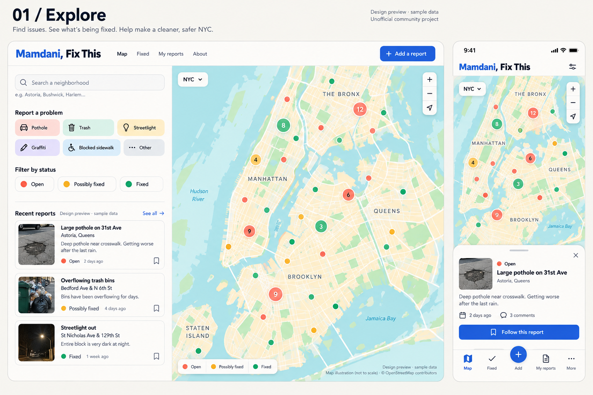
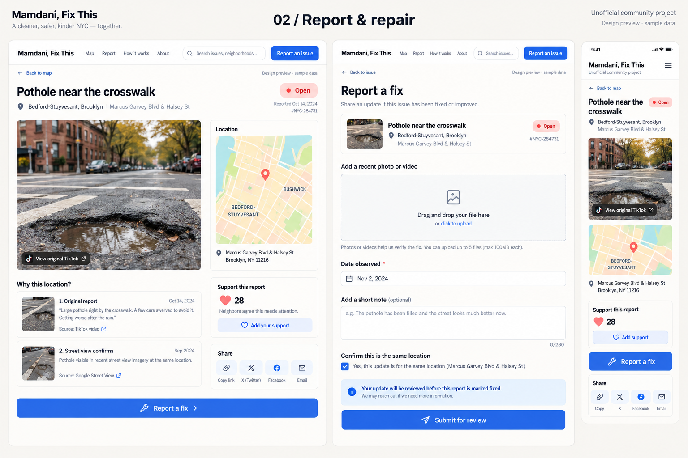
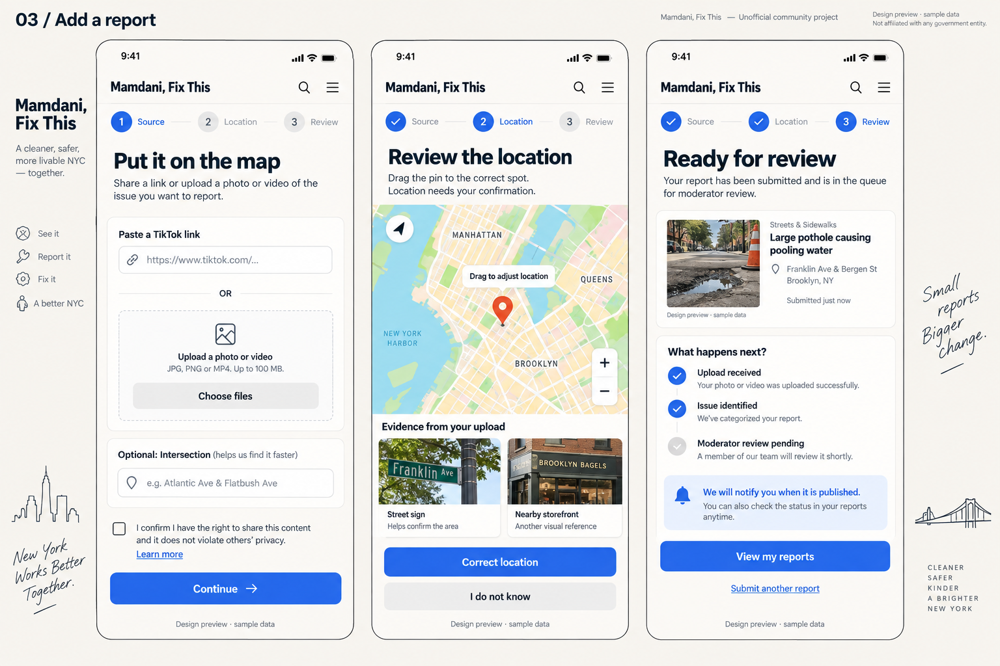
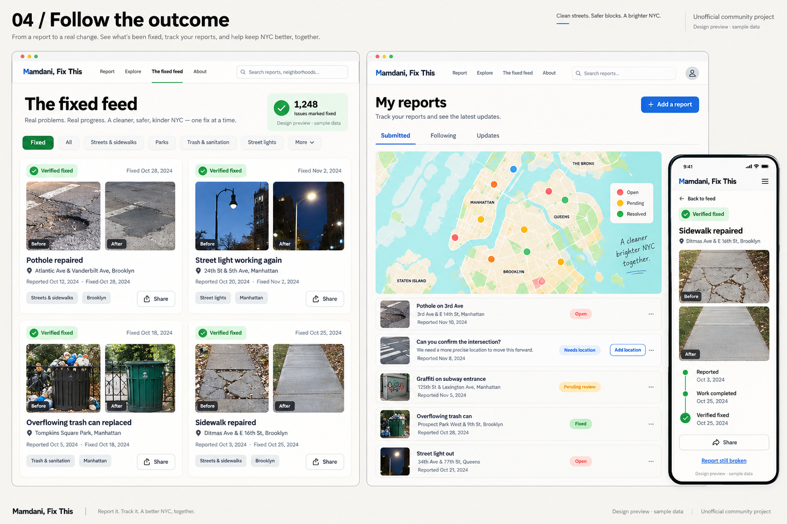
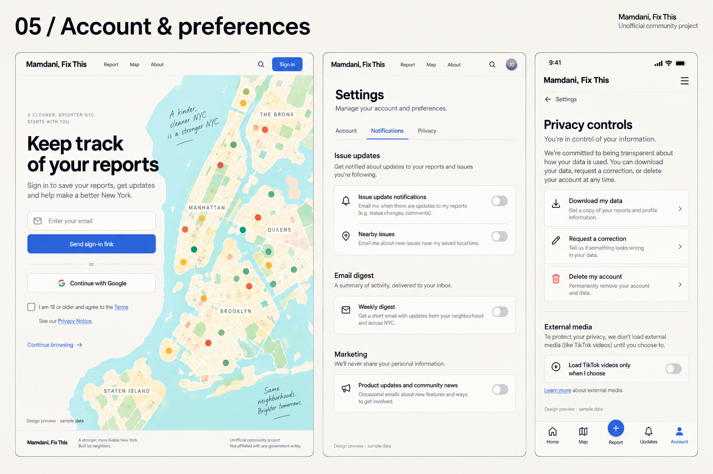
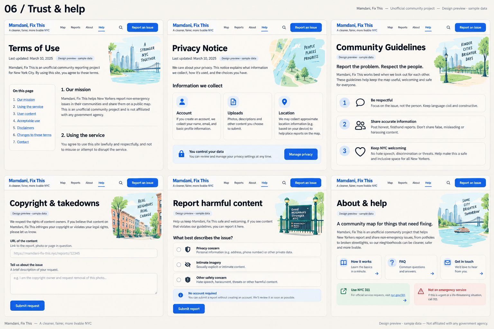
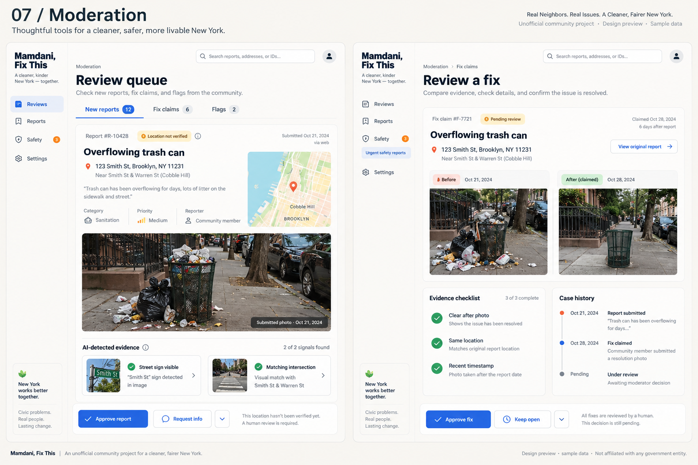

> Legal copy is a review draft, not a guarantee against liability. Mockups use fictional sample content and illustrative maps. Final implementation follows the written requirements.

# Mamdani, Fix This — Product and Engineering Spec

Version 1.2 · September 22, 2026 · Working title, not a cleared brand or available domain

**Changes in 1.2.** This revision fixes six weaknesses found in review of 1.1:

1. **The name was load-bearing and uncleared.** Section 0 adds a hard decision gate: name clearance is resolved before Milestone 2 ends, and the product is designed so that renaming costs one config file, not a redesign.
2. **TikTok ingestion was described as a marquee feature but is not available.** Section 4B now leads with the flow that will actually work (upload + intersection), and treats a pasted link as an attribution and dedup key, not a media source. AI analysis is reframed as an assist on user-uploaded media.
3. **Moderation, not infrastructure, is the scaling limit.** Section 12 adds a review-capacity model, an intake cap tied to reviewer-hours, a triage order, and a rule that publication standards never loosen to clear a backlog.
4. **GeoSpy was consuming spec attention it has not earned.** It moves to Milestone 4 and is removed from all Milestone 1–3 acceptance criteria.
5. **The document was scoped for a 3–4 person team.** Section 19 now splits every milestone into "launch-minimum" and "hardening" so a solo builder ships a usable map before touching load tests or restore drills.
6. **Growth depended entirely on a trend.** The Fixed feed (before/after, time-to-verified-fix) is promoted to a co-primary surface with the map, because it is the part that stays interesting after the trend fades.

Legal templates (sections 23–28) still require the operator details, actual data practices, and appropriate legal review before publication. They do not guarantee immunity from fines or claims.

## 0. Decision gates and kill criteria

Every gate has an owner, a deadline relative to the build sequence, and a written outcome. Do not carry an unresolved gate into the next milestone.

| Gate | Resolve by | Pass condition | If it fails |
|---|---|---|---|
| G1 Name clearance | End of Milestone 2 | Counsel has reviewed "Mamdani, Fix This" for NY Civil Rights §§50–51 and trademark/domain conflicts and written a go/no-go | Switch `BRAND_NAME`, domain and OG assets to the reserved neutral brand (see below). Describe the trend editorially in About. No redesign. |
| G2 Submission conversion | 2 weeks after soft launch | ≥ 5% of unique report-page visitors open `/submit`; ≥ 30% of started submissions reach `pending_review` | Fix the submit flow before building any AI assistance. Do not start Milestone 2 processing work while this fails. |
| G3 Return visits | 4 weeks after soft launch | ≥ 15% of accounts that submitted return within 14 days | Invest in the Fixed feed and per-issue update notifications, not in ingestion. |
| G4 Review capacity | Continuous | Median time from `pending_review` to decision ≤ 48 h; oldest pending ≤ 7 days | Intake cap engages automatically (section 12). Recruit moderators before loosening anything. |
| G5 Trend health | Before Milestone 3 spend | The Mamdani repair trend is still producing new NYC clips weekly, or the Fixed feed alone is driving G3 | If neither holds, stop at Milestone 1+ share cards. Do not fund the media worker host or paid analysis. |
| G6 Analysis value | End of Milestone 2 beta | AI proposals are accepted by moderators with ≤ 2 edits in ≥ 60% of cases, at a measured cost per accepted report the owner is willing to pay | Keep the manual flow as the product. Disable paid analysis; keep the adapters. |

**Brand isolation requirement.** All references to the product name, domain, tagline and social handles live in one config module (`packages/contracts/brand.ts`) and one environment variable set. UI copy, OG cards, email templates and legal pages read from it. Reserve a neutral fallback brand and domain before public promotion so G1 failing costs a deploy, not a rebuild. Public URLs use `/r/{slug}-{shortId}`; the slug never contains the brand name.

## 1. What we are building

An unofficial, mobile-first map of real NYC problems people want Mamdani to fix, and a record of what actually got fixed. Someone uploads a photo or video (optionally with the TikTok link it came from), tells us roughly where it is, and a moderator publishes a reviewed report. People follow issues, submit repair evidence, and share before/after stories.

The product has two co-primary surfaces, and both must work at Milestone 1:

- **The map** — what needs fixing and where. This is the entry point from the trend.
- **The Fixed feed** — before/after evidence and the measured interval between report and verified fix. This is the part that stays interesting after the trend fades, and the part people actually share.

The product should feel like the TikTok trend became a useful website. It is specifically about Mamdani and NYC. Do not dilute the launch into a generic platform for every city. Do not make it look like enterprise ticketing software or a campaign donation site.

**What this is not.** It is not a TikTok scraper. The app does not download arbitrary TikToks and cannot promise to; see section 4B. The pasted link is attribution and a duplicate key. The evidence is what the user uploads.

**One-line hook:** “Tag Mamdani. Put it on the map.” (Subject to gate G1; the hook must also read correctly with the fallback brand.)

**Primary promise:** See what needs fixing, where it is, and what happened next.

**Success:** People submit useful reports, return for updates, and share verified fixes. Traffic is useful only if the map remains trustworthy and affordable.

This spec describes proposed engineering choices and measurable targets, not existing functionality or guaranteed capacity. Provider facts checked against official documentation are linked at the end. Dollar scenarios are assumptions unless explicitly labeled published prices.

## 2. Decisions to commit to

| Decision | Choice | Reason |
|---|---|---|
| Launch platform | Responsive web app; progressively enhance to an installable PWA | One codebase; links open immediately from TikTok |
| Frontend | React + TypeScript + Vite, Tailwind CSS, accessible headless UI primitives | Familiar stack, static deployment, small operational footprint |
| Map renderer | MapLibre GL JS | Open-source rendering; supports vector maps and clustering |
| Basemap | NYC-region Protomaps PMTiles on R2, served as cached vector tiles through a Worker | Control tile delivery and cost; no commercial per-map-load contract needed for this setup |
| API | TypeScript + Hono on Cloudflare Workers | Thin API close to CDN; shared frontend schemas |
| Database/auth | Supabase Postgres + PostGIS + Auth | Geospatial queries, relational integrity, accounts in one service |
| Media storage | Private Cloudflare R2 bucket for originals; separate approved public derivatives | Direct uploads and independent media lifecycle |
| Background analysis | Python container with FFmpeg and provider adapters on a small paid Linux host | Video processing stays outside HTTP requests and edge runtime limits |
| Initial queue | Postgres jobs table with leases and SKIP LOCKED claims | Avoid Redis and a separate queue service at launch |
| AI | Configurable multimodal and transcription providers; small-model-first policy; Milestone 2 only, gated by G6 | Evaluate quality and pricing before locking to a model |
| GeoSpy | Milestone 4 candidate only; adapter interface exists, no integration work before G6 passes | Access, price, and NYC usefulness are unconfirmed; explicit-clue geocoding does most of the work |
| TikTok link | Attribution + canonical dedup key + click-to-load embed. Never a media source. | No download entitlement exists; designing around one produces a broken flagship feature |
| Publishing | Moderator approval initially | Wrong public pins damage trust faster than a review delay |
| Team assumption | One builder, one to three part-time moderators at launch | Scope, review capacity and hardening order are sized to this; revise the spec if the team changes |
| Brand | Isolated in one config module; neutral fallback reserved | G1 may fail; renaming must be a deploy, not a rebuild |
| Resolved reports | Hide from active map; keep in Fixed view and archive | Preserve shareable history |
| Monetization | None required for MVP | No ads, payment stack, or paid reach before usefulness is established |

Avoid Kubernetes, Kafka, microservices per feature, Elasticsearch, a separate vector database, native mobile apps, and automatic citywide TikTok scraping at launch. Add infrastructure only when measurements justify it.

## 3. Scope and product rules

Launch categories: potholes, damaged sidewalks, broken park equipment, broken public fountains, overflowing public trash, and broken streetlights. Allow “Other public-space issue” into review, not automatic publication.

Publish infrastructure locations, not locations of people. Do not turn this into tracking creators, finding homes, or mapping allegations against individuals. Strip unnecessary faces, license plates, and identifying details from public evidence when feasible; moderators can withhold a frame entirely.

Every report displays “Unofficial community project. Not affiliated with NYC government or Mamdani’s office.” Put this in About and a compact persistent footer/menu location. A published report does not mean it has been sent to City Hall or 311. Show “Submitted to agency” only with actual submission evidence.

Use “Reported fixed” and “Verified fixed” accurately. Do not claim Mamdani personally caused a repair unless there is evidence supporting that attribution. The brand can be playful; report facts must be literal.

Browse without an account. Require a verified account to publish submissions, support reports, and submit repair evidence. Allow drafting and uploading after a lightweight verification step so abandoned uploads are bounded. No public comment threads in MVP: they add moderation cost without being necessary to prove the product.

## 4. Core user journeys

### A. Open from TikTok

Land directly on a report page, not a login wall. Immediately see the problem, neighborhood, current status, source link, and “View on map.” Load the first evidence image before the interactive map. Offer a share button and “See other reports nearby.”

### B. Submit a report

The primary path is **upload + location**. It is the only path that works at Milestone 1 and the only path that is guaranteed to work at all, because the app has no entitlement to download TikTok media. Design and test this path first; everything else is an enhancement to it.

1. **Choose a photo or video** (up to 5 photos / one 60 s clip; limits in section 8). Upload directly to private storage with real progress.
2. **Pick a category** from the six launch categories, or "Other public-space issue" (review only).
3. **Say where it is.** Required, not optional: an intersection, address, or a pin dragged on the map. Offer "Use my location" only as a convenience to center the map; the submitter confirms the pin. Geocode explicit text within the NYC boundary polygon. The location is stored as `precision=user_supplied` and is still moderator-reviewed before publication.
4. **Optionally paste the TikTok link** it came from. The app canonicalizes it, checks whether that post already has a report (if so, open it and offer support or additional evidence), stores it as the source for attribution, and shows a click-to-load embed on the report page. Nothing is downloaded. The link field is labelled "Where did you see this? (optional)" and never implies the video will be analyzed.
5. **Attest upload rights** (unchecked checkbox, section 27) and preview the public fields.
6. **Submit.** Return a saved submission immediately. Stages shown honestly: Uploaded, Pending review, Needs more info, Published. Notify in-app; optional email only if enabled.
7. **Moderator reviews** the evidence and the supplied location, adjusts the pin if needed, and approves or asks for more information.

**Milestone 2 enhancement (gated by G6).** After upload, a background job may transcribe audio, sample frames, propose a category and title, and extract location clues (spoken address, street signs, storefronts) to cross-check the user's supplied location. The stage list gains "Analyzing" between Uploaded and Pending review. Analysis produces a proposal for the moderator; it never replaces the user's location question and never publishes. If analysis is disabled, paused or fails, the flow is identical to Milestone 1. Users must not be able to tell the difference except for a richer moderator view.

**Link-only submissions.** If a user has only a link and no media they have rights to upload, accept it as a `link_only` draft with category and location text. It enters a low-priority review lane. Moderators may publish it only if they can independently verify the issue (for example, a second submitter uploads media at the same location). It is never published on the strength of the link alone. Do not build a fetch-TikTok-media path for this; if a supported creator-authorized import becomes available (Milestone 4), it slots in here.

Fallback is a first-class flow, not an error screen. "We couldn't confirm this location. Can you add a nearby intersection?" is better than an invented pin.

### C. Browse the map

Default to NYC with active issues, clustered at low zoom. Filters: category, borough, and Open / Possibly fixed / Fixed. The active view includes open and fix-pending issues; verified fixed is off by default. Support map/list switching. Store selected report and filters in the URL for sharing and back-button behavior.

Click a cluster to zoom. Click an individual feature to open one detail panel. Selecting a report never triggers AI. Map cards use short factual titles, neighborhood, age, status, and one thumbnail.

### D. Report a fix

1. Any verified account can submit a new photo/video with an observed date and optional note.
2. Report moves to fix_pending only after basic validation; it stays on the active map with “Possibly fixed.”
3. AI may compare the asset and scene and flag contradictions. It does not authorize resolution.
4. Moderator checks same location, same asset, recent evidence, and what is visibly repaired. Submitter confirmation is helpful but not sufficient by itself in MVP. A TikTok username typed into a form is not proof of creator ownership.
5. Approval sets resolved_at, creates a status event, updates map caches, and generates a new share card.
6. Reopening also requires review. Keep the resolution and reopening history. Partial repairs stay open with an update.

No age-based automatic resolution. Old reports get a “Last checked” date and can be requested for re-verification. A deleted video is not evidence of a repair.

## 5. Visual design and mobile behavior

Use a warm cream canvas (#F7F5EF), charcoal text (#17211D), cobalt accent (#255BDB), and restrained orange (#D96A27). Test actual text/background pairs for WCAG AA; colors are starting tokens, not a contrast guarantee. Status uses text and distinct icons in addition to color. Use a red/orange issue marker, amber clock for pending repair, and green check for verified fixed.

Typography: a self-hosted, licensed sans such as Inter; strong compact headlines, readable body text, tabular numerals for counts. Use typography, map, and actual evidence as the visual identity. No giant gradients, random stock photos, excessive glass effects, or oversized animated hero section.

Desktop: full-height map, 360–400 px report/list panel, compact top controls, primary “Add a report” button. Selected report can expand into a wider detail drawer. Filters never obscure map attribution.

Mobile: full-screen map with top search/filter controls and a bottom sheet at approximately 20%, 50%, and 90% height. The collapsed sheet shows a selected report summary or nearby count. Explicit close/back controls accompany drag gestures. Bottom navigation: Map, Fixed, Add, My reports. A visible Map/List switch supports low-power devices and accessibility.

Support 360 px width, safe-area insets, dynamic viewport height, portrait/landscape, iOS Safari, Android Chrome, desktop browsers, and TikTok’s in-app browser. Test file picking and authentication in the in-app browser; provide “Open in browser” guidance when necessary. Do not require installation, web push, location permission, or a native share target.

Touch targets at least 44×44 CSS px. Body text approximately 16 px. Respect reduced-motion. Keep keyboard focus in open dialogs and restore it on close. Provide a complete keyboard-accessible report list because the map cannot be the only way to use the app.

Request current location only after “Near me” or “Use my location.” Do not silently infer a report’s location from the submitter’s device. Device location is neither where the clip was filmed nor proof the issue exists.

PWA phase: manifest, icons, standalone display, cached app shell, and a clearly stale read-only recent view. Never cache private admin responses or signed media URLs. Keep small draft text locally with user consent; do not promise durable background video uploads on mobile browsers.

## 6. Map architecture

Keep **basemap** and **issue data** separate. Streets/water/labels change slowly. Reports change frequently. They need different update and caching policies.

### Basemap

Use a NYC-region extract with enough buffer for the surrounding metro and viewport edges. Pin the data build and style version. Host its PMTiles archive on R2. A dedicated tile Worker exposes versioned /basemap/{version}/{z}/{x}/{y}.mvt endpoints using the supported Protomaps integration. Serve compatible styles, font glyphs, and sprites through the CDN too. Verify clipping, available zooms, overzoom behavior, and CORS with real devices.

A new basemap release gets a new URL, so old tiles can be cached immutably. Refresh on an operational schedule such as monthly; urgent issue updates do not rebuild the basemap. Preserve required OpenStreetMap/data/style attribution. Do not use the public OpenStreetMap tile server as free production infrastructure. MapLibre is a renderer, not a free tile-hosting service.

### Issue overlay: first release

Publish a sanitized, compact active-issue snapshot per borough plus a citywide compact snapshot for initial browsing. Include only id, coordinates, category, status, and minimal display fields. Cluster with MapLibre’s GeoJSON source. Fetch descriptions, media, and evidence only for selected reports.

Use map layers rather than thousands of React/HTML markers. Use stable feature IDs and feature-state for highlighting. Do not recreate the map on component renders. When snapshot payload exceeds 500 KB compressed or typical rendering exceeds the device budget, switch the dense views to spatial tile endpoints; do not keep increasing the full-city payload indefinitely.

### Issue overlay: growth stage

Generate cached issue vector tiles by z/x/y and a constrained filter set. Use PostGIS with spatial indexes; at low zoom return preaggregated counts/cells, not every point. At higher zoom return bounded feature sets. Deduplicate edge features by issue ID when querying loaded tiles. Fetch full details separately.

Never use arbitrary floating-point bounding boxes as the only CDN keys: slight pans destroy reuse. Use canonical tile coordinates or fixed grid cells. Validate zoom, coordinate bounds, category values, and response size. Cap over-detailed requests instead of permitting expensive global scans.

For a report with insufficient location evidence, retain candidates privately. Do not place a precise public pin. During MVP only reviewed locations are published; an approximate neighborhood result stays in the review queue.

## 7. System topology and responsibilities

Public browser requests go to the CDN for assets, map tiles, public snapshots, and cached report pages. Cache misses reach the thin API. Authenticated writes go to the API, which validates Supabase identity and calls narrowly scoped database operations. The browser uploads bytes directly to R2 with short-lived upload authorization.

Postgres stores issues and jobs. The Python worker (Milestone 2) claims jobs and calls transcription, multimodal and geocoding services; search and visual-geolocation adapters exist as mocks until Milestone 4. It writes structured proposals and evidence. A moderator approves them. A transactional outbox drives public projection updates, CDN purge work, and share-card jobs.

Only the API and worker possess private keys. Use a dedicated database role with narrowly scoped functions for public reads and bounded mutations. Never expose service-role credentials. Enable and test RLS for tables reachable through Supabase APIs. Use pooled connections or HTTP RPC at the edge, and a small bounded connection pool for the long-lived worker.

Deploy the worker near the database. Keep the HTTP request path free of FFmpeg, long model calls, and synchronous external research. One worker process with two configurable concurrent media tasks is a reasonable initial setting; benchmark memory before raising it. Container CPU/memory limits and process timeouts prevent a malformed clip from exhausting the host.

## 8. Analysis pipeline and evidence contract

Each step is durable, idempotent, and individually retryable. Save completed outputs so a late failure does not redo transcription or geolocation.

1. **Validate:** verify magic bytes, media dimensions/duration, upload ownership, and stored size. Initial product limits: 60-second clips, 50 MB/video, 10 MB/photo, and up to 5 photos. These are configurable launch limits, not provider limits.
2. **Deduplicate:** canonical platform video ID first; SHA-256 content digest next. Perceptual hashes only propose similar media. Reuse analysis without revealing another account’s private submission or private cached result.
3. **Extract:** FFmpeg samples approximately 6–10 useful frames with timestamps, removes near-identical frames, and creates one audio track. Preserve a higher-resolution crop only when a sign needs it. Never analyze every frame by default.
4. **Transcribe and triage:** collect spoken text, on-screen text, issue category, visible evidence, and requested action. Label actionable / uncertain / non-actionable; allow sarcasm when it documents a real issue. A joke label alone is not a deletion instruction.
5. **Cheap location clues first:** supplied intersection, spoken address, OCR signs, nearby businesses, landmarks. Geocode explicit clues within NYC. Check against the actual NYC boundary polygon, not only a rectangular bounding box.
6. **Optional research (Milestone 4):** bounded search and candidate lookup, and a `VisualGeolocationProvider` slot (GeoSpy is one candidate) if a provider has been contracted, evaluated against the section 18 holdout set, and budget remains. Not part of Milestone 2 acceptance. Limit retries, candidate count, and tool calls. Never assume matching borough is enough for a street-level pin. In practice the user-supplied location from section 4B step 3 is the primary signal; research only cross-checks it.
7. **Corroborate:** attach direct observations and source provenance to each candidate. Two models making the same guess are not independent evidence. The same blog copied onto two sites is not independent either.
8. **Find duplicates:** spatial candidate search with category and time context. For point assets, begin with a configurable 30–50 m candidate radius; for long sidewalk/trash issues use category-specific rules. Human review decides merges. Nearby distinct potholes must remain distinct.
9. **Create proposal:** save reasoned structured fields, missing evidence, candidate coordinates, model/provider versions, estimated cost, and review recommendation. Do not publish directly.

Required proposal fields:

```json
{
  "schema_version": 1,
  "actionability": "actionable|uncertain|non_actionable",
  "category": "pothole",
  "title": "Pothole near a marked intersection",
  "observed_at": null,
  "location_candidates": [{
    "latitude": 0,
    "longitude": 0,
    "precision": "asset|intersection|block|neighborhood",
    "evidence_ids": ["evidence-id"],
    "contradiction_ids": [],
    "verification": "unverified"
  }],
  "missing_information": [],
  "suggested_duplicate_ids": [],
  "needs_human_review": true
}
```

The zeros above are schema placeholders, never valid fallback coordinates. Evidence records contain type, timestamp/frame ID or URL, retrieved_at, observed text, a concise explanation, and content digest where allowed. Do not expose model chain-of-thought; show factual evidence summaries.

Confidence is separated into issue confidence and location confidence. Do not display an uncalibrated “97% certain” generated by a model. Initially use evidence-based labels such as “Location reviewed” and “More evidence needed.” Evaluate automatic publication later against an independently labeled holdout set and a written precision target.

## 9. Data model and state machines

| Entity | Important fields / rules |
|---|---|
| profiles | auth user ID, display name, role; no email in public projections |
| submissions | owner, canonical source, draft text, job state, idempotency key |
| source_posts | platform + platform post ID unique, URL, availability; one post can document multiple issues |
| issues | UUID, slug, category, factual title, point geometry SRID 4326, precision, borough, status, revision, last_verified_at |
| issue_sources | many-to-many links between issues and source posts |
| media | owner, private object key, digest, MIME, duration, observed_at, retention deadline, publication permission |
| evidence | media frame or source URL, provenance, supporting/contradicting claim, review visibility |
| location_candidates | submission ID, geometry, evidence, provider; private until reviewed |
| updates | issue, author, kind, observed_at, proposed status, moderation state |
| status_events | old/new state, actor, reason, evidence IDs, timestamp; append-only |
| supports | unique issue + authenticated user; toggle is idempotent |
| jobs | stage, state, attempts, next_run_at, lease_until, lease token, pipeline version, cost reservation |
| outbox | durable post-transaction actions and retries |
| provider_usage | job, provider, units, estimated/actual cost, reservation state |
| abuse_flags | target, reason, reporter, resolution; never exposed as public accusations |

Processing states: draft → queued → processing → needs_input or pending_review → accepted/rejected. Failed processing can retry; that is separate from issue status.

Issue states: open → fix_pending → resolved. A rejected fix returns to open. A reviewed reopening returns resolved to open. Moderator may hide an issue or mark it duplicate with canonical_issue_id. Hidden and duplicate records are excluded from map counts. Every transition runs through a checked database function with expected revision to prevent stale approvals.

Indexes: GiST on issue geometry; a matching indexed geography expression/column for meter-based distance queries; B-tree on status/category/borough/created_at; unique canonical source identifier; unique supports key; jobs(state,next_run_at); outbox(state,next_run_at). Use ST_DWithin on geography for meters. Longitude precedes latitude when constructing points. Test this explicitly.

Use keyset pagination by created_at and id for lists. Precompute public support totals and summary statistics periodically; do not run COUNT(*) across the full dataset on every page view.

## 10. API surface

| Endpoint | Purpose / caching |
|---|---|
| GET /api/public/manifest | Current published snapshot versions; short cache |
| GET /api/public/snapshots/{version}/{borough}.json | Sanitized immutable map snapshot |
| GET /api/public/issues/{id} | Public details; short cache + ETag |
| GET /api/public/issues?cursor=… | Bounded, allowlisted filters and pagination |
| GET /api/public/stats | Precomputed factual totals |
| GET /api/public/tiles/{z}/{x}/{y}.mvt | Growth-stage bounded spatial data |
| POST /api/submissions | Save draft; idempotency key required |
| POST /api/uploads/sign | Verify quota and ownership; issue constrained upload authorization |
| POST /api/uploads/{id}/complete | Revalidate stored object; enqueue analysis |
| GET /api/submissions/{id} | Owner-only processing progress; no shared cache |
| PATCH /api/submissions/{id} | Owner draft correction; revision check |
| PUT /api/issues/{id}/support | Idempotently set supported=true/false |
| POST /api/issues/{id}/updates | Submit new evidence or proposed fix |
| POST /api/issues/{id}/flags | Flag abuse or inaccurate location |
| POST /api/admin/reviews/{id}/decision | Moderator-only transactional approval |

Use schema validation for all inputs and outputs. Return stable machine-readable error codes plus helpful text. A queued request returns 202 and a submission ID. Return 429 with Retry-After for temporary limits. Never silently drop accepted work.

## 11. Cache plan: the main cost-saving mechanism

**A thousand people opening the same report should not cause a thousand AI calls, database queries, or share-image renders.**

| Data | Cache key | Initial policy | Update behavior |
|---|---|---|---|
| Hashed JS/CSS/fonts | content hash | 1 year immutable | New asset URL |
| Basemap tiles/style | build version + z/x/y | 1 year immutable | New basemap version |
| Public map snapshot | borough + publication version | Long-lived immutable | Manifest points to new snapshot |
| Public manifest | fixed key | 30 sec | Refresh after publishing |
| Issue detail | issue ID | 30 sec fresh + up to 120 sec stale where supported | Purge on transition; TTL fallback |
| Filtered public lists | normalized finite filters + cursor | 30–60 sec | Outbox purge or TTL |
| Public statistics | statistics version | Recompute every 60 sec | No expensive live counts |
| Thumbnails/share cards | issue revision + asset digest | Immutable for ordinary updates | New URL; takedown override |
| Geocoding | normalized query + NYC scope + provider version | Up to 30 days if contract permits | Revalidate conflicts; short negative cache |
| Analysis | media digest + pipeline/model/prompt version | Durable internal result | Explicit reanalysis only |
| Owner/admin responses | none | private, no-store | Never CDN-cache |

Implement the CDN’s actual supported caching/purge behavior; do not assume writing a Cache-Control header automatically caches every API route or provides stale-while-revalidate everywhere. Test cold and warm requests from multiple regions. Authorization or cookies must never contaminate public projections. Personalized support state comes from a separate private request.

Publish one map batch every 15–30 seconds when events exist, not a full snapshot per support click. Store the new immutable projection first, then atomically advance the manifest pointer. Keep the last known good snapshot if regeneration fails. Show “Updated …” so stale data is visible. Normal map status propagation target: within 60 seconds.

Client caching: TanStack Query for details/lists, request deduplication, AbortController for obsolete fetches, 250–400 ms debounce on search, and map requests on moveend rather than every pan frame. Keep a bounded in-memory cache of visited tiles. Do not automatically refetch all reports on focus.

Prevent stampedes with per-key single-flight/leases for expensive projection generation. Public immutable objects carry no private fields. Media takedowns must override normal caching: deny new edge delivery, purge known paths and projections, remove origins, and acknowledge browser/social caches may persist. Do not promise remote copies can be erased instantly.

## 12. Handling thousands of users

Separate registered accounts, daily active users, concurrent browsers, reads per second, and new submissions. They create very different costs. Most visitors should browse without creating auth sessions or database connections.

Initial design/load-test targets:

| Scenario | Assumed workload | Required behavior |
|---|---|---|
| Early launch | 1,000 DAU; 100 concurrent; 100 submissions/day | Smooth browsing and reviewable queue |
| Growing | 10,000 DAU; 1,000 concurrent; 1,000 submissions/day | CDN absorbs reads; processing bounded by budget |
| Viral stress test | 5,000 concurrent; 1,000 edge requests/sec for 15 min; 100 attempted submissions/min | Cached browsing stays available; writes throttled and accepted jobs remain durable |

These are acceptance-test scenarios, not promises that the smallest database or worker will pass unchanged. Distinguish map tile requests from database requests when measuring.

Illustration: 10,000 DAU × 2 sessions × 20 cacheable app reads = 400,000 reads/day. At an achieved 95% CDN hit rate, about 20,000 reach origin, before writes and excluding tiles/assets. At 1,000 edge requests/sec and 95% hit rate, origin still receives approximately 50/sec. Run hot-cache and cold-cache tests; a 95% assumption is not a capacity guarantee.

Worker sizing: required average concurrency ≈ submissions_per_day × average_processing_seconds / 86,400. At 1,000/day and 45 seconds each, average occupied slots ≈ 0.52. Two slots offer theoretical throughput of 3,840/day, but burstiness, provider limits, memory, retries, and review capacity reduce practical throughput. Scale from measured queue age, not theoretical arithmetic alone.

Queue reliability: claim jobs in a short transaction using FOR UPDATE SKIP LOCKED; commit before external calls. Heartbeat long tasks. A lease token fences out stale workers so an expired worker cannot overwrite a newer result. Use at-least-once execution, unique stage outputs, exponential backoff with jitter, and a dead-letter state after three retries. Do not hold database locks during AI calls.

Scale worker replicas separately from read traffic. Start with a configurable maximum of four concurrent paid analysis jobs and lower provider-specific limits. More visitors do not automatically increase model concurrency. Reserve job budget atomically before a call and settle actual usage after it; crashed reservations need expiry/reconciliation.

### Review capacity is the real scaling limit

Everything above scales reads with a CDN. Nothing scales human review. At two minutes per report, 1,000 reports/day need roughly 33 reviewer-hours/day; a solo operator with an hour a day clears about 30. If the product goes viral, the review queue backs up in hours while the map keeps serving fine. Plan for this explicitly rather than discovering it.

**Capacity model.** `daily_review_capacity = Σ(moderator_hours_per_day) × 60 / minutes_per_review`. Store `minutes_per_review` as a measured rolling value, not the 2-minute guess. Publish the current capacity and backlog on the admin dashboard.

**Intake cap (automatic).** When `pending_review_count > 2 × daily_review_capacity` or the oldest pending item exceeds 7 days, the submit flow switches to **waitlist mode**: uploads are still accepted and stored, but the UI says "Review is backed up; expect about N days" with N computed from the backlog, and the daily per-account submission limit drops from 3 to 1. Browsing, supports, and fix evidence on already-published reports are unaffected. The cap releases automatically when the backlog falls below 1× capacity. Gate G4.

**Triage order.** The review queue is sorted, not FIFO:

1. Safety and rights reports (separate clock, section 26) — always first.
2. Fix evidence on published reports — resolving something is the product's payoff; a 30-second review.
3. New submissions with complete evidence (media + user-supplied location + category), newest first.
4. New submissions missing information — send the "Needs more info" request in bulk; they leave the queue until the submitter responds.
5. `link_only` drafts — lowest lane; may age out after 30 days with notice.

**Reviewer roles.** `moderator` can approve/reject/request-info and adjust pins. `senior_moderator` can additionally merge duplicates, hide, handle flags, and reopen. `admin` manages roles, feature flags and budgets. Every decision writes an audit row (actor, before, after, reason). New moderators shadow-review 20 items (their decisions are recorded but not applied) before being enabled.

**What never happens.** Publication standards do not loosen to clear a backlog. There is no "auto-approve if the queue is old" rule. Support counts do not skip review. If the backlog is unmanageable for weeks, the correct response is more moderators or a narrower intake (fewer categories, fewer boroughs), and the About page says so.

**Reviewer tooling is a Milestone 1 deliverable**, not a Milestone 3 nicety: keyboard-driven approve/reject/needs-info, the pin adjustable on a map, the evidence and source side by side, duplicate candidates within 50 m shown inline. Every 10 seconds shaved off a review is worth more than any cache optimization in this document.

No WebSockets for every map visitor. Poll processing status only while its owner watches: start at 5 seconds, back off to 15–30, stop in background tabs and terminal states. Public snapshots refresh at most once per minute while active or through user refresh. Consider realtime later for narrow needs.

## 13. Performance budgets

Target mobile field metrics at the 75th percentile: LCP ≤2.5 s, INP ≤200 ms, CLS ≤0.1. Target an interactive useful map within 3.5 s on a documented midrange phone / throttled network test. These are product goals to verify.

First route shell target ≤200 KB compressed JS excluding lazily loaded map code. Measure the map chunk separately. Report pages should show readable content before map initialization. Limit initial evidence downloads, use responsive WebP/AVIF thumbnails, explicit image dimensions, lazy media, and only one active video player. Never autoplay every TikTok embed in a feed.

Public cached API p95 target <200 ms; uncached read p95 <700 ms in representative regions; submission acknowledgement p95 <1 s excluding upload. Analysis p95 target <120 s only under normal admitted load and healthy providers; communicate queue delays separately.

Render at most a few hundred list items through virtualization, and paginate server results 25–50 at a time. Disable terrain, 3D buildings, continuous animations, and unnecessary map rotation at launch. Pause work in hidden tabs. Fall back to the list when WebGL is unavailable or repeatedly loses context.

## 14. Costs, quotas, and spending controls

Published prices checked September 22, 2026: Supabase Pro starts at $25/month for the initial included project configuration; Cloudflare Workers Paid has a $5/month minimum. R2 Standard lists $0.015/GB-month storage, $4.50/million Class A operations, and $0.36/million Class B operations, with free internet egress. Included allowances and other charges apply; recheck before purchase. Free egress does not mean free requests, processing, or every service in the stack.

Plan an initial fixed infrastructure allowance of **$40–$80/month**, before AI/GeoSpy/search, domain, SMTP, unexpected overages, and optional monitoring. This is a planning envelope: $25 database + $5 edge minimum + an assumed $10–$30 worker host + headroom. Worker hosting is not a quoted vendor price.

Use a variable-cost formula:

```json
monthly cost = base infrastructure
  + unique analyzed submissions × measured analysis cost
  + GeoSpy calls × contracted rate
  + search/geocoding calls × applicable rate
  + storage GB-month × applicable rate
  + storage operations + edge compute + email + monitoring + backup costs
```

Sensitivity table for the analysis component ONLY; these are illustrative unit costs, not model quotes:

| Unique analyses/month | $0.01 each | $0.05 each | $0.20 each |
|---|---|---|---|
| 1,000 | $10 | $50 | $200 |
| 10,000 | $100 | $500 | $2,000 |
| 30,000 | $300 | $1,500 | $6,000 |

Example storage assumption: 1,000 uploads/day × 15 MB average × 7 days raw retention ≈105 GB steady-state raw data, roughly $1.58/month at the listed R2 storage rate before allowances, operations, derivatives, and backups. If average uploads are 50 MB, that becomes about 350 GB. Measure bytes; do not mistake the upload limit for the average. Video processing and paid model calls may dominate storage.

Initial configurable guardrails: 3 new submissions/account/day; 5 evidence updates/account/day; per-IP soft limits with challenge and appeal for shared networks; maximum 2 pending uploads/account; 4 concurrent analysis jobs; 10 frames/job; 3 external search calls/job; GeoSpy at most 2 images/job when enabled. Set actual quotas after beta observations.

Owner-selected starting AI budget: e.g. $5/day and $100/month, with warnings at 50%, 80%, 95%. Stop admitting paid analysis when either cap is reached; keep saved drafts, manual reports, browsing, and moderation usable. A daily cap does not replace a monthly cap. Include retries and escalations in the reservation. Provider dashboards can lag; enforce your own conservative limits and configure provider hard limits where available.

Do not rerun analysis on views, shares, votes, map pans, status polling, or page refresh. Reuse transcript/frame outputs. Use larger models only for a bounded minority of unresolved cases. Ask the user a location question before buying more guesses. Cache external data only as provider permissions allow.

Raw media retention proposal: delete seven days after terminal processing unless explicitly retained for an appeal; maximum thirty days for stuck jobs with advance user notice. Approved public evidence derivatives persist while the report needs them, subject to deletion/takedown. Give retention jobs monitoring and retry behavior, including removal of orphaned uploads after 24 hours. Keep copyrighted source playback through supported embeds when available rather than rehosting entire videos by default.

## 15. Security and abuse controls that matter to this product

Validate TikTok hostnames and redirect destinations; a pasted URL must not become arbitrary server-side network access. Block internal, link-local, and metadata addresses, including after DNS resolution/redirects. Limit redirects, response bytes, and fetch time. Fetch through dedicated provider adapters rather than allowing model-generated URLs to execute freely.

Use short-lived upload authorization scoped to one generated object key. Check actual object size and file content after upload, not only the browser’s claimed MIME or size. Uploads stay quarantined until validated. Decode media in a restricted process. Never let model output run shell commands, SQL, or administrative actions.

Treat captions, transcripts, screenshots, and retrieved pages as untrusted input. Instructions inside a video must never override analysis rules or reveal credentials. Tool calls are allowlisted, budgeted, and schema-validated. Provider results are evidence candidates, not authority.

Protect admin accounts with MFA and backend role checks. Check ownership on every private ID lookup. Use explicit trusted CORS origins and CSRF protection for cookie-authenticated mutations. Rate-limit sign-in emails to prevent email bombing. Use one support per account, server-generated timestamps, revision checks, and audit logs. Support counts measure app accounts, not verified NYC residents.

## 16. Failure behavior and operational controls

| Failure | Product behavior |
|---|---|
| TikTok inaccessible/private/deleted | Keep factual report if independently supported; mark source unavailable; request uploaded evidence |
| No downloadable media | Link-only draft and upload/location fallback |
| GeoSpy unavailable | Continue explicit-clue geocoding/manual location workflow |
| AI budget exhausted | Save draft, show paused analysis, keep map operational |
| Worker crashes | Expiring lease requeues work; completed stages reused |
| Database interruption | Serve last good public snapshot; reject new writes clearly rather than pretending saved |
| Tile delivery fails | Show report list and static location text; retry map separately |
| Wrong location discovered | Hide/correct through reviewed revision, purge projections, preserve audit record |
| Viral spam | Rate limits, challenge, bounded queue, temporary intake pause |
| Review backlog | Honest pending state and estimated delay; no automatic trust downgrade |

Admin panel: pending location proposals, duplicate candidates, repair claims, flags, job failures, oldest queue age, provider usage, spend reservations, and feature flags. Emergency switches: pause new uploads, pause paid analysis, disable a provider, make writes read-only. Keep public cached browsing available during these controls where possible.

Use structured logs with request/job IDs, stage duration, safe error code, provider units, and revision. Do not log raw videos, access tokens, signed URLs, or private transcript contents by default. Track cache hit ratio by route, database p95/p99, pool utilization, worker memory, jobs awaiting review, provider failures, and projected daily/monthly spend. Review provider invoices against usage estimates.

Backups: confirm database backup availability for the purchased plan, keep an encrypted scheduled export, and perform a restore drill. Target RPO ≤24 h and RTO ≤4 h initially; validate them. Back up configuration and approved evidence separately. A database backup does not restore deleted object storage. Document retention and restore access. Apply the deletion ledger before a restored environment becomes publicly accessible so removed content is not republished.

## 17. Sharing and growth features

Every published report gets a canonical /r/{slug}-{shortId} URL with server-generated HTML title, description, and Open Graph tags. Do not rely on client-side JavaScript for social crawlers. The Worker can render a minimal escaped HTML document that hydrates the React route.

Generate a 1200×630 Open Graph card and a downloadable 1080×1920 vertical story card per approved report revision. Include factual title, neighborhood, date/status, issue link, and subtle unofficial branding. Render once in the background, cache the output, and regenerate only on meaningful changes. Do not add a claim that the mayor saw it or fixed it unless confirmed.

Use Web Share API where supported; fall back to copy link and image download. Do not promise direct TikTok posting. Social networks cache link previews independently, so a changed status may not instantly update an old preview; the live report is authoritative.

### The Fixed feed is the durable growth surface

The map depends on the trend. The Fixed feed does not. A before/after pair with "Reported Mar 3 → Verified fixed Mar 19 (16 days)" is shareable whether or not anyone is tagging the mayor that week, and it is the only content on the site that gives a submitter a reason to come back. Treat it as co-primary with the map (section 1) and design it to be the thing people screenshot.

Requirements:

- `/fixed` is a first-class route at Milestone 1 with its own OG card, not a filter on the map.
- Each entry shows the before evidence, the after evidence, the neighborhood, and the interval between `created_at` and `resolved_at`, labeled exactly as "time from report to verified fix." It is not proven city response time and the UI never calls it that.
- The vertical 1080×1920 story card (below) is generated for every verified fix, with before/after side by side. This is the primary share asset; the open-issue card is secondary.
- Per-issue notification opt-in ("Tell me when this is fixed") is offered on every open report page and on submission confirmation. This is the retention loop that gate G3 measures.
- Aggregate, precomputed and honest: "N verified fixes · median M days" on the Fixed page header, recomputed hourly. No "fixes this week" counter that can read zero on a slow week; show the running total.
- Sorts: Newest fixed, Fastest fix, Longest wait. All transparent; no "trending."

Elsewhere, "Needs attention," "Newest," and "Most supported" are transparent sorts; support count is not severity.

Seed launch with 15–30 real, reviewed, well-supported reports. Show source attribution and permission-appropriate media. No fabricated activity, automated spam mentions, or fake solved counters. Prepare a short screen recording of the end-to-end flow, invite creators to submit updates through genuine outreach, and track whether visitors actually submit or return. Notification opt-in should be per issue or digest, not constant default email.

## 18. Evaluation and release gates

Build a labeled set of at least 100 permitted NYC examples, mixing clear real issues, jokes with real evidence, pure jokes, missing context, duplicates, out-of-city clips, outdated clips, and repaired issues. Split by source/location so near-identical frames do not leak between tuning and holdout sets.

Measure actionable-report precision/recall, wrong precise-pin rate, location error distance, abstention rate, duplicate false merges, fix-confirmation errors, processing p50/p95, and actual cost per unique accepted report. Report both coverage and precision: refusing every case is not a useful geolocator. A small dataset can expose problems but cannot prove rare-error safety. Keep human review until evidence supports a defined change.

Meaningful automated tests:

- URL canonicalization and safe redirect handling; unsupported hosts rejected.
- Repeated submission creates one job; retries do not double-publish or double-count support.
- An expired worker cannot commit a stale result.
- Longitude/latitude ordering, boundary checks, and meter-based duplicate search.
- Private evidence cannot appear in public snapshots, cached pages, or another owner’s response.
- Status revisions prevent stale fix approvals; resolved issues leave active projections within the freshness target.
- Budget reservation remains bounded when several workers start simultaneously.
- Provider failures (transcription, geocoding, visual geolocation when enabled) and unavailable TikTok embeds produce usable fallback states identical to the Milestone 1 manual flow.
- Intake cap engages when pending_review exceeds 2× measured daily capacity and releases below 1×; submissions during waitlist mode are stored, not dropped.
- Changing the brand config module updates every user-facing name, OG card, email template and legal page; no hard-coded product name survives a grep.
- Review triage order is honored: a fix-evidence item submitted after 100 new reports is offered to the moderator before them.
- Media deletion removes derived objects and invalidates relevant public caches.

Browser QA: 360/390/768/1440 px widths; keyboard navigation; screen-reader list; reduced motion; denied location; slow network; iOS and Android file upload; interrupted upload/retry; in-app browser login; unavailable WebGL; deleted source video.

Load tests: read-heavy hot-cache and cold-cache traffic, panning through fresh tiles, authenticated write bursts, worker/provider throttling, and moderation updates during active reads. Use deterministic mocked paid providers for scale tests, then a small real-provider calibration run. Record limits and cost instead of claiming “supports millions.”

Launch gates: no critical auth/privacy bugs; complete submit-review-publish-resolve-reopen path; no fabricated provider integrations; cache invalidation validated; budget cutoff validated; restore drill complete; verified initial content; actual device performance measured. If a gate fails, document the blocker and fix it before public promotion.

## 19. Build sequence

This spec is sized for **one builder**. Sections 6–16 describe the correct end state, but building all of it before anyone uses the product is the most likely way this project fails. Each milestone is therefore split into a **launch-minimum** column (ship this, then stop and measure) and a **hardening** column (do this only when the gate in section 0 or a measurement says so). Nothing in the hardening column blocks the next milestone's launch-minimum.

| Milestone | Launch-minimum (do this) | Hardening (do only when measured) | Exit gate |
|---|---|---|---|
| **M1 — Useful map, no AI** (target: 1–2 weeks) | Schema + migrations (issues, submissions, media, updates, status_events, supports, profiles; jobs/outbox tables created but unused). Clearly labeled local fixtures. Map + list with clustering, category/borough/status filters, URL state. `/r/:slug` report page with server-rendered OG tags. `/fixed` feed with before/after and interval. Supabase auth. Upload + location submit flow (4B steps 1–7). Moderator review screen with pin adjust, approve/reject/needs-info, keyboard shortcuts. Fix-evidence submission and moderator verification. Reopen. Support toggle. Unofficial disclaimer, `/about`, `/terms` and `/privacy` routes with bracketed drafts visibly marked DRAFT. Brand config module. Real Protomaps basemap on R2. Deploy to a staging URL. | Public snapshot projections + manifest (serve directly from Postgres via short-TTL Worker cache until >2,000 published issues). Vector issue tiles. Load tests. PWA. Restore drill. | 15–30 real reviewed reports placed by real people. G2 measurement starts. |
| **M2 — Assisted submission** (only if G2 passes and G5 holds) | Python worker + leased jobs table. FFmpeg frame sampling + transcription via one small provider. Structured proposal (section 8 schema) shown in the moderator view alongside the user's own location. Explicit-clue geocoding to cross-check the pin. Duplicate candidates within 50 m surfaced inline. Cost reservation + daily/monthly cap. Analysis-paused state. Mock adapters for local dev. | Multimodal frame analysis. Search provider. Larger-model escalation. Content-digest analysis cache. Perceptual-hash dedup. | G6 (analysis value) and **G1 (name clearance) written down**. If G6 fails, keep adapters, disable analysis, ship M3 anyway. |
| **M3 — Public launch** | Story/OG cards rendered in background. Snapshot projections + manifest + CDN cache + purge on transition (this is when traffic justifies it). Takedown flow and `/report-content` no-login intake with a separate urgent clock. `/copyright` with real agent details or the route hidden. Security tests from section 18 (URL/SSRF, ownership, private-evidence leak, stale-revision). Mobile device pass at 360/390 px including TikTok in-app browser. Error monitoring. Encrypted DB export on a schedule. All bracketed legal fields filled or the production-readiness check fails. | Restore drill. Cold/hot-cache load tests. Vector tiles. Rate-limit challenge pages. Multi-region latency checks. | Launch gates in section 18. G4 monitoring live. |
| **M4 — Grow from measured demand** | Whatever the measurements say. Candidates in rough priority: more moderators and shadow-review onboarding; per-issue notifications; worker replicas; vector issue tiles when snapshot >500 KB; `VisualGeolocationProvider` (GeoSpy) evaluation against the holdout set; creator-authorized import if a supported path exists; selective realtime. Government 311 data cross-reference only after checking matching semantics — a closed request is not a physical repair. | — | Ongoing. |

Finish each milestone as a working vertical slice. Do not spend weeks on the analysis pipeline before a user can place and resolve a reviewed report. Do not run a load test before there is real traffic to calibrate it against. Do not build a restore drill for a database with 30 rows.

**Time-boxing rule.** If M1 launch-minimum is not on a staging URL within three weeks, cut scope from M1 rather than extend it. Candidates to cut, in order: PWA, `/fixed` sorts other than Newest, borough filter, list virtualization, story card. Never cut: moderation before publish, the disclaimer, upload-rights attestation, the location step.

## 20. Repository and deliverables for the builder

Use a monorepo:

```json
apps/web/                 React UI and responsive routes
apps/api/                 Worker API and server-rendered share metadata
workers/media/            Python pipeline and FFmpeg tasks
packages/contracts/       Shared schemas and generated types
packages/ui/              Small reusable accessible components
db/migrations/            Versioned SQL, RLS, indexes, transition functions
infra/                    Deployment configuration and environment examples
tests/                    Integration, end-to-end, and load scenarios
docs/                     Runbook, provider setup, evaluation, cost report
```

Provide a README with local startup, migrations, provider setup, deployment steps, environment variables, backup/restore, and known limitations. Include .env.example with placeholder values only. Commit lockfiles and pin supported versions after checking compatibility. Use CI for type checks, linting, meaningful tests, migration checks, and build validation. Production seeds must never contain fake public reports.

Required adapters: MediaSourceProvider, TranscriptionProvider, VisionProvider, Geocoder, VisualGeolocationProvider, SearchProvider, ObjectStore. Mock implementations work in local development and are visibly labeled. Missing production credentials disable a feature gracefully; they must never silently fabricate a successful analysis.

## 21. Copy-paste implementation prompt

You are the senior product engineer implementing “Mamdani, Fix This,” an unofficial NYC community map built around the Mamdani TikTok repair trend. Treat the full specification above as the source of truth. Build a real mobile-first product, not a decorative landing page or generic city dashboard.

Use React/TypeScript/Vite, Tailwind, MapLibre GL JS, Protomaps PMTiles on R2 with cached tile delivery, a Hono Cloudflare Worker API, Supabase Postgres/PostGIS/Auth, and a Python media worker. Start with a leased Postgres jobs table. Preserve the ability to swap external AI/geolocation providers. Avoid adding services unless a measured requirement justifies them.

Implement in milestones, building only the **launch-minimum** column of section 19 for each milestone unless a measurement or a section 0 gate says otherwise. First deliver the complete manual journey: upload + location submit, moderator review with pin adjust, publish, browse map/list, the `/fixed` feed, submit repair evidence, verify resolution, reopen, and share a report. The moderator tool is a Milestone 1 deliverable with equal priority to the public map. Then, only if gates G2 and G5 pass, add background AI assistance as a moderator aid. At each milestone make the application runnable, inspect the UI at mobile and desktop sizes, and test the important data transitions before continuing.

The visual direction is warm cream, charcoal, cobalt, restrained orange, clean readable typography, a prominent NYC map, compact filter chips, and a mobile bottom sheet. It should feel credible, local, and internet-native. No giant marketing hero, fake statistics, gradients everywhere, or nonfunctional buttons.

The TikTok link is attribution and a dedup key, never a media source; do not build any path that downloads TikTok media. The submitter's uploaded media and stated location are the evidence. Do not integrate GeoSpy or any visual-geolocation provider before Milestone 4; leave the `VisualGeolocationProvider` interface with a mock. Put the product name, domain and tagline in one brand config module so gate G1 failing is a config change. Do not invent an API endpoint, pretend a link was analyzed, publish guessed locations, or label demo data as real. AI produces structured proposals and source evidence; a moderator publishes and resolves issues in the first release.

Implement the review-capacity model and automatic intake cap from section 12 at Milestone 1; publication standards never loosen to clear a backlog.

Keep all expensive tasks out of HTTP requests. Deduplicate before analysis; cache transcripts, frames, and final proposals by content and pipeline version. Reserve spending atomically, bound concurrency/retries, and keep cached browsing available when paid analysis pauses. Implement versioned public map projections, private/no-store authenticated routes, direct-to-storage uploads, and correct cache invalidation for status changes and takedowns.

Optimize for thousands of browsing users with CDN delivery, bounded map payloads, clustering, pagination, lazy media, pooled database access, and clear load-test evidence. Do not promise a user count without measurements. Mobile behavior, evidence provenance, resolution correctness, cost visibility, and honest failure states are acceptance requirements.

Make reasonable implementation decisions within the spec. Ask only for genuinely blocking credentials or product choices. Finish all work possible with local adapters first. Never purchase services, publish externally, or send outreach without the appropriate authorization. Deliver the repository, migrations, responsive working app, setup/runbook, tests, measured performance results, and a concise list of real remaining integration blockers.

## 22. Official references and validation notes

These sources support provider capabilities and listed prices, not the architecture’s untested throughput or proposed product behavior. Recheck prices, limits, terms, and API availability at implementation time.

1. TikTok Display API: https://developers.tiktok.com/docs/en/display-api-overview — creator video/profile metadata and display; do not equate it with arbitrary video downloading.
2. TikTok Research eligibility: https://developers.tiktok.com/products/research-api/ — qualifying researcher access; not an assumed ingestion entitlement for this product.
3. MapLibre clustering: https://maplibre.org/maplibre-gl-js/docs/examples/create-and-style-clusters/ — GeoJSON cluster rendering.
4. Protomaps deployment: https://docs.protomaps.com/deploy/cloudflare — supported Worker/R2 delivery approach.
5. PMTiles storage: https://docs.protomaps.com/pmtiles/cloud-storage — range requests and cross-origin requirements.
6. Protomaps MapLibre assets: https://docs.protomaps.com/basemaps/maplibre — styles require appropriate fonts and sprites too.
7. Supabase PostGIS: https://supabase.com/docs/guides/database/extensions/postgis — spatial extension and queries.
8. Supabase pricing: https://supabase.com/pricing — production base plan and usage limits; auth user allowances do not prove database request capacity.
9. Cloudflare Workers pricing: https://developers.cloudflare.com/workers/platform/pricing/ — account minimum and compute/request billing.
10. R2 pricing: https://developers.cloudflare.com/r2/pricing/ — storage, operation, and egress pricing.
11. GeoSpy: https://geospy.ai/ and https://dev.geospy.ai/docs/api — integration candidate; confirm actual account access, permitted use, pricing, confidence semantics, and performance before enabling. Do not confuse similarly named independent services with this provider.

Unresolved integration decisions, in the order they actually block something:

1. **Name clearance (G1)** — blocks public promotion at Milestone 3. Nothing else in this list matters if the product has to rename after launch.
2. **Compliant geocoding provider and caching rights** — blocks the Milestone 1 location step's autocomplete. Interim: NYC's open Geosearch API or a self-hosted Pelias/Nominatim over the NYC extract, both of which avoid caching-rights problems.
3. **Production SMTP** — blocks account email at Milestone 1 staging. Supabase's built-in sender is acceptable for staging only.
4. **Chosen AI transcription/vision models** — blocks Milestone 2 only. Decide by a ≤ 50-clip benchmark, not by reading pricing pages.
5. **Worker host quote** — blocks Milestone 2 only.
6. **Search provider** — Milestone 4 hardening.
7. **GeoSpy or any visual-geolocation contract** — Milestone 4 only. Do not spend time on this before G6.
8. **TikTok access** — assume none. If a creator-authorized import path is approved later, it slots into the `link_only` lane (section 4B). The product must not depend on it.

None of these prevents the Milestone 1 map, submit, review, fix and share flows from being built and put in front of people.

## 23. Legal launch plan

Assumptions: US operator, NYC-focused free app, public user reports, no ads/payments, accounts and submissions limited to adults 18+. These are draft operating choices, not a determination that every law applies. The templates below need actual operator details, matching technical controls, and US internet/privacy counsel review before publication. Terms alone cannot guarantee protection from fines or claims. Do not assume NYC subject matter makes only New York law relevant.

### Required launch controls

| Requirement | What to build / resolve |
|---|---|
| Real operator | Actual individual/entity name, monitored contact and appropriate lawful mailing address; no invented LLC or agent |
| Branding | Review Mamdani name/domain/promotional use; no official seals, campaign marks, likeness-based ads or implied endorsement |
| Terms | Unchecked acceptance at account creation, links, versioned server-side record; enforce through OAuth too |
| Privacy | Accurate data inventory, vendor disclosures, retention, deletion/export/contact flow |
| Upload permission | Per-submission rights attestation; narrow service license; link-only option when upload rights are missing |
| Copyright | Assess applicable DMCA safe harbor, register/publish agent if pursuing it, maintain repeat-infringer and notice/counter-notice procedures |
| Safety requests | Public no-login form, private case tracking, urgent alerts, separate statutory deadlines |
| Minors | 18+ participation plus actual underage-data handling; review COPPA and NY child-data rules |
| Security | MFA, restricted evidence, vendor agreements, incident response and tested deletion |
| Licenses | Map attribution, font/icon/media rights and THIRD_PARTY_NOTICES |
| Email | Optional updates, separate marketing choice, appropriate unsubscribe and sender information |
| Accessibility | Usable list alternative, keyboard routes, labeled forms and monitored contact |

The name stays in this concept, but is not legally cleared. NY Civil Rights Law §§50–51 addresses certain uses of a living person's name/likeness for advertising/trade. Civic commentary and app branding need context-specific review; an unofficial disclaimer is not blanket permission. Keep merchandise, monetization, campaign coordination and paid political advertising out of launch until separately reviewed. If needed, consider a separately cleared neutral brand with the trend described editorially; do not silently rename the project. [L1]

NY SHIELD guidance requires reasonable safeguards for covered private information. Build a breach-response plan; counsel should determine the actual notification recipients/deadlines rather than inventing one universal deadline. [L2]

An 18+ checkbox does not establish all visitors are adults. COPPA can cover child-directed services and actual knowledge of under-13 collection; New York has separate under-18 protections. Minimize visitor data, avoid ad tracking and investigate underage reports. Do not collect identity documents just to strengthen a checkbox without a justified, reviewed process. [L3, L4]

CalOPPA privacy-notice requirements and comprehensive state privacy laws have different tests. Being below a CCPA threshold does not eliminate all privacy duties. Review the operator location, users, vendors and processing. Reassess before targeting international audiences. [L5, L6]

## 24. Draft Terms of Use — /terms

**DRAFT: replace all bracketed fields and obtain appropriate review before publication.** Effective date: [DATE]. Operator: [LEGAL OPERATOR NAME], [APPROPRIATE BUSINESS ADDRESS]. Contact: [SUPPORT EMAIL]. Service: [APP NAME] at [DOMAIN].

### The service

[APP NAME] is an independent community service for reporting and reviewing public-space conditions in New York City. We are not affiliated with, authorized by, or endorsed by Zohran Mamdani, his office, the City of New York, TikTok, or any government agency. Publishing here does not file a government service request or ensure an official will see or act on it. Any actual agency submission will be identified separately.

This is not an emergency service. For immediate danger in the United States, call 911. Use official NYC 311 channels for ordinary government service requests. Do not trespass, enter unsafe areas, obstruct traffic or confront people to obtain evidence.

### Accounts and agreement

You must be at least 18 to create an account or submit material. Selecting the agreement checkbox and creating an account signifies agreement to these Terms. Public reports can be browsed without an account. Keep account access secure and provide accurate account information. Do not impersonate an official, another person, or the creator of a linked video.

### Your content and permission

You retain your rights in submitted material. You must own it or have adequate permission or another lawful basis for its submission and our permitted use. A publicly viewable video is not automatically licensed for downloading, rehosting, copying its music, or advertising. Submit a source link and your own factual observations if you do not have upload rights.

You grant [OPERATOR] a nonexclusive, worldwide, royalty-free license to store, process, transcribe, analyze, resize, redact and display your submitted material as needed to operate the service, review reports and provide report-specific sharing features. Contracted providers may process it for these service purposes. This is not an ownership transfer or permission for unrelated advertising, likeness promotion or unrelated model training. Separate permission and appropriate disclosures are needed for such additional uses. You can only grant rights you actually hold.

Approved descriptions, issue locations, selected evidence, source links and your chosen display name can become public, shared and searchable. Account email is not published. Preview public fields before submitting. Do not include unnecessary private information, intimate imagery, threats or unsupported allegations about people.

### Automated assistance and accuracy

Automated tools may suggest summaries, categories, duplicates and locations. They can be wrong. Human review does not guarantee accuracy, current conditions, completeness or safety. “Location reviewed” describes a review; “Verified fixed” means evidence was accepted as of the displayed observation/review date. Neither is government certification, a guarantee a repair will last, nor proof of who performed it.

### Acceptable use and moderation

Follow the Community Guidelines. Do not fabricate evidence presented as real, violate others' rights, harass people, upload malicious files, manipulate support counts, evade limits or attempt unauthorized access. We may request clarification, redact, decline, hide, merge or remove material and restrict accounts. Urgent concerns may require immediate action. Where appropriate, we provide a reason and an appeal through [APPEAL FORM]. Repeated infringement may lead to termination in appropriate circumstances.

### External services and removal

Third-party links and players have their own terms/privacy practices and may be unavailable. Loading a player may share technical information with its provider as explained in our Privacy Notice. A source link is not an endorsement.

Use [PRIVACY FORM] for data requests, [COPYRIGHT PAGE] for ownership claims and [SAFETY PAGE] for urgent harmful content. No account is needed to report rights or safety concerns. Account deletion does not necessarily delete independent facts or other people's evidence about the same issue. We assess your personal data and submitted material separately. Removal from third-party copies/caches cannot be guaranteed.

### Availability, responsibility and changes

To the extent permitted by law, the service is provided as available without warranties about uninterrupted operation, report accuracy, repairs or fitness for a particular purpose. Nothing excludes rights or liabilities that cannot lawfully be excluded or prevents contacting a regulator. Ordinary report review has no guaranteed response time; statutory rights-request duties are handled separately.

[COUNSEL TO COMPLETE: appropriate liability limitation and governing law/venue based on the real operator. Do not automatically add forced arbitration, class-action waiver, sweeping indemnity or arbitrary damages cap. No subscription/refund clause is needed for this free launch.]

We publish effective dates and retain policy versions, give appropriate notice of material changes and obtain renewed agreement where required. Changes do not retroactively authorize unrelated reuse. Contact [SUPPORT EMAIL].

## 25. Draft Privacy Notice — /privacy

**DRAFT: this describes the proposed controls. Reconcile every statement with the deployed app and vendors before publishing.** Effective date [DATE]. Operator [LEGAL OPERATOR]. Contact [PRIVACY EMAIL].

### Data and purpose

| Information | Why used | Public visibility |
|---|---|---|
| Email, login identifier, display name | Accounts/authentication | Only chosen published display name |
| Text, links, photos/video/audio and observation date | Review reports and updates | Approved portions |
| Issue coordinates and supporting clues | Locate infrastructure | Reviewed issue location |
| Optional device location | Center map or help choose a pin | Never automatically public |
| Supports/follows/preferences | Save choices and requested updates | Aggregate counts; no follower list |
| IP, browser/device and security events | Delivery, abuse prevention and troubleshooting | Private |
| Requests and correspondence | Rights, appeals and legal duties | Restricted; legal-process disclosures where needed |

Normal use does not require a home address, contact list, location history or government ID. Device location is permission-based. The proposed Near me function uses coordinates locally; only deliberately submitted issue coordinates become report records. Public image derivatives have location metadata stripped. Uploaded originals can contain metadata, faces, speech or other personal details; avoid unnecessary information.

### Providers and automated processing

We use [ACTUAL HOSTING/STORAGE/AUTH PROVIDERS] to operate the service and [ACTUAL AI/TRANSCRIPTION/LOCATION PROVIDERS] for analysis. Relevant media/text/coordinates may be sent to those providers. Describe the actual retention, training settings, regions and recipients here: [PROVIDER DETAILS]. Do not say “never used for training” without confirmed terms/settings. Authorized reviewers inspect evidence. Facial identification and finding people's homes are not app features.

### Public content and external media

Published reports can be indexed, shared and copied. Third-party players are blocked until you choose to load them. Loading one may send your IP/browser/activity information to its provider. External links leave this service when followed. Media choices are available in Settings.

### Cookies and sharing

The proposed launch uses essential session/security storage and interface preferences. [DESCRIBE ACTUAL ANALYTICS; SAY NONE ONLY IF TRUE.] The launch does not include targeted-advertising trackers or personal-data sales. Audit vendor arrangements for legally defined sale/sharing, add required opt-outs and honor applicable recognized preference signals if relevant. Describe actual legacy Do Not Track behavior: [DNT RESPONSE]. Do not confuse DNT with legally recognized opt-out signals.

Information goes to service providers, restricted reviewers, recipients required by lawful process and appropriate fraud/safety responders. List other actual recipients before launch. Private account information is not silently sent to City Hall. An agency-submission feature must show what is sent and obtain the appropriate instruction.

### Retention

The following are proposed product targets, not promises to publish until configured:

| Record | Target |
|---|---|
| Abandoned uploads | Delete after 24 hours |
| Raw uploads | Delete 7 days after terminal processing unless a documented exception applies |
| Stalled jobs' originals | Resolve/delete by 30 days with notice |
| Normal security logs | 30 days; documented incidents may need longer restricted retention |
| Approved evidence | While needed for report history, subject to rights requests and periodic review |
| Closed-account identifiers | Normally remove/de-identify within 30 days after verified request, subject to legal duties/exceptions |
| Rights-case records | Minimum justified period established with counsel; avoid retaining harmful media unnecessarily |
| Backups | Rolling expiration within 30 days where configured; disclose actual vendor differences |

Applicable legal deadlines take precedence. Retained exceptions are restricted to justified purposes. A restore must reapply the deletion ledger before public access. Third-party copies and backups may not vanish instantly.

### Choices, rights, age and security

Request access, correction, deletion or other applicable rights through [FORM/EMAIL]. Identity verification is proportionate. Rights, exceptions, deadlines and appeal options vary by law: [REQUIRED JURISDICTION DISCLOSURES]. Turn off optional updates, revoke location permission, change external-media preferences or request account deletion in Settings.

Accounts/submissions are intended for adults 18+. Report suspected improper child-data collection to [PRIVACY EMAIL]; we investigate and act appropriately. We use reasonable security measures but cannot guarantee absolute security. Give appropriate notice before material changes and new incompatible uses. Contact [OPERATOR/EMAIL].

## 26. Guidelines and rights/safety processes

### Community Guidelines — /guidelines

**Report the problem. Respect the people.** Show real public-space conditions. Distinguish observations from assumptions. Sarcasm is fine; fabricated evidence presented as real is not. Label relevant edits and do not present old footage as current. Focus on infrastructure, not identifying, shaming or locating people. No intimate imagery, threats, private contact information, harassment or unsupported accusations. Only upload content you have rights to share; credit does not replace permission, including for music. Stay safe and lawful while recording. Proposed fixes need recent evidence. Support counts do not establish truth or residency. Use the rights/safety form for concerns and [APPEAL FORM] for moderation appeals.

### Copyright & takedowns — /copyright

Draft introduction: “We respect intellectual-property rights. If material on this service infringes your copyright, contact our designated agent below. Privacy or safety concerns can be reported through Report harmful content; you do not need to claim copyright to report them.”

Publish the actual designated agent's name, address, telephone and email after the appropriate registration. If seeking applicable DMCA safe-harbor protection, complete all relevant conditions, not merely registration: expeditious handling, appropriate repeat-infringer policy and other applicable requirements. Set a renewal reminder ahead of the agent designation's three-year expiration. [L7, L8]

Notice form: claimant contact, copyrighted work, precise offending report/media URL, good-faith authorization statement, accuracy/authority statement under penalty of perjury and signature. Explain potential forwarding of the notice; never post the claimant's details publicly. Counter-notices need the statutory elements, including removed-material identification, mistake/misidentification declaration, contact, jurisdiction/service-of-process statements and signature. Counsel must approve the exact forms. Compliant counter-notices involve a 10–14 business-day restoration process unless notice of the specified court action intervenes. Do not use that clock for privacy or intimate-image cases. [L9]

Technical workflow: case ID, acknowledgement, appropriate access restriction, notification to submitter as appropriate, recorded action, purge thumbnails/share cards/CDN projections, and restrict necessary case records. Preserve independently supplied lawful evidence where appropriate. Avoid blanket claims that fair use or section 230 protects everything, especially the app's own generated assertions.

### Report harmful content — /report-content

No login required. Link from every media item and the footer. Categories: privacy exposure, nonconsensual intimate imagery, threat/safety concern, wrong location/false report, and other. Copyright has a separate route but cannot block urgent safety intake.

Collect relevant page/media IDs, issue description, follow-up contact and only necessary authority/identity information. Do not require reupload of intimate imagery. Provide a case number and private receipt/status link. A statutory intimate-image form needs the legally required signed identification, location/contact information and good-faith lack-of-consent statement; validate wording with counsel.

Assess TAKE IT DOWN Act coverage. FTC guidance says covered platforms must provide a clear process and remove qualifying reported intimate imagery and known identical copies within 48 hours of a valid request. Both real and forged imagery can be covered. An infrastructure focus or small size is not an automatic exemption. Build a separate urgent clock, weekend alerts, escalation and duplicate-removal verification. Prohibit this content regardless of final coverage analysis. [L10]

Draft public copy: “Report private information, threats or intimate imagery shared without consent. No account is required. Provide the page link or report ID; do not upload another copy of intimate imagery. Urgent concerns are reviewed separately from infrastructure reports, and qualifying requests are handled within applicable legal deadlines.” Only publish with real staffing/processes.

Suspected child-exploitation or other illegal content requires a separately reviewed preservation/reporting procedure and assessment of applicable reporting duties. Limit staff access; do not circulate files in normal chat/email. Do not promise immediate destruction of all records when preservation law may require otherwise.

## 27. Consent, disclosure and operational checklist

| UI placement | Required proposed copy / behavior |
|---|---|
| About/menu/footer | “Unofficial community project. Not affiliated with Mamdani's office or the City of New York.” |
| Sign-up | Unchecked: “I am 18 or older and agree to the Terms of Use.” Adjacent Privacy Notice link |
| Upload | Unchecked: “I own this material or have the rights needed to submit it under the Terms.” |
| Public preview | “If approved, the report's location, selected evidence, source links and display name will be public.” |
| AI | “We use automated tools to help review uploads and suggest locations. Suggestions can be wrong.” |
| External video | “Load TikTok video. TikTok may receive your IP address and browser information.” Click-to-load plus external link |
| Government status | “Publishing here does not submit a request to NYC 311.” |
| Help | “For immediate danger, call 911. This site is not monitored as an emergency service.” |
| Email | Unchecked optional issue-update choice; marketing, if introduced, separate |
| Footer/More | Terms, Privacy, Guidelines, Copyright, Report content, Accessibility, Contact, Attribution |

Store user ID, timestamp and immutable terms version on acceptance; record upload rights separately. Do not treat privacy notice acknowledgement as consent to all uses. Safety requests need no terms acceptance. Test backend authorization, not only UI visibility.

Avoid decorative cookie banners. Start essential-only; click-to-load external media. If nonessential tracking is introduced, implement the applicable consent/opt-out flow and verify blocked requests do not fire early. Give persistent controls and appropriate equal access to choices.

Marketing email needs applicable CAN-SPAM sender identification, unsubscribe and other controls; confirm address and suppression requirements. Account creation does not make every email transactional. Do not add SMS at launch. [L11]

Preserve map attribution on interactive and exported maps. Maintain dependency/asset license notices. Do not claim blanket accessibility compliance; provide working accessible routes and monitored requests. [L12]

Operator must resolve: actual entity/name/domain/contact; branding review; provider data terms/regions/retention/training; privacy-law applicability; minors policy; designated agent and case workflow; urgent-content coverage/response staff; terms jurisdiction/liability language; deletion/backup configuration. Entity formation and insurance may merit discussion, but are not guarantees or substitutes for lawful operations.

Before launch, counsel should see an actual upload, report page, consent screenshots, vendor agreements, data-flow description and incident/takedown procedure. Do not publish bracketed fields. No “official,” “guaranteed fix,” “100% accurate,” “all anonymous” or “never stored” claims unless precisely true.

## 28. Legal reference register

Checked September 22, 2026. These primary sources support the checklist, not a legal conclusion about this specific app. Confirm applicability and changes before launch.

- **L1 — Name/likeness:** https://www.nysenate.gov/legislation/laws/CVR/50 and https://www.nysenate.gov/legislation/laws/CVR/51
- **L2 — SHIELD:** https://ag.ny.gov/resources/organizations/data-breach-reporting/shield-act
- **L3 — COPPA:** https://www.ftc.gov/legal-library/browse/rules/childrens-online-privacy-protection-rule-coppa
- **L4 — NY child data:** https://ag.ny.gov/child-data-protection-act-guidance
- **L5 — Privacy notices:** https://oag.ca.gov/node/36676
- **L6 — CCPA:** https://oag.ca.gov/privacy/ccpa
- **L7 — DMCA agent:** https://www.copyright.gov/dmca-directory/
- **L8 — Renewal:** https://www.copyright.gov/dmca-directory/faq.html
- **L9 — Section 512:** https://www.copyright.gov/512/
- **L10 — TAKE IT DOWN:** https://www.ftc.gov/business-guidance/resources/complying-take-it-down-act
- **L11 — Email:** https://www.ftc.gov/business-guidance/resources/can-spam-act-compliance-guide-business
- **L12 — Maps:** https://osmfoundation.org/wiki/Licence/Attribution_Guidelines

## 29. Illustrated UI handoff

Seven image boards cover the main app routes and reusable help/legal layouts. Generated with the built-in image tool; full prompts are in UI_Generation_Prompts.json in the download package. The boards are visual concepts, not working screens, actual evidence, final policy copy or precise maps. Use real components and actual map data when building.

Map palette: aqua water #BDE8EA, mint parks #CDE7BE, butter blocks #F6E6B8, peach secondary areas #F6DBCE, white roads. Keep cream panels, charcoal text and cobalt actions. Coral open markers, amber pending markers, green resolved markers. Color always has a label/icon alternative. Test actual contrast. Use 16 px cards, fine borders and 8 px spacing increments; one clear primary action per panel.

| Board | Routes/states |
|---|---|
| 01 Explore | / map/list sidebar, desktop and mobile selected-report sheet |
| 02 Report & repair | /r/:id, /r/:id/report-fix, mobile report |
| 03 Submission | /submit/source, /submit/location, /submit/review |
| 04 Outcomes | /fixed, /my-reports, resolved report |
| 05 Account | /sign-in, /settings, /settings/privacy |
| 06 Trust & help | /terms, /privacy, /guidelines, /copyright, /report-content, /about |
| 07 Moderation | /admin/reviews, review proposal, review repair |

/help, /contact and /accessibility reuse About/help with appropriate copy and forms. /cookies, if required, reuses Privacy controls. Callback, empty, not-found, source-unavailable, no-WebGL, paused-analysis and request-receipt states reuse existing components. Safety receipts use unguessable private links, no indexing and no third-party analytics.

### Binding image QA corrections

The written requirements override incidental generated text. Generated maps are geographically inaccurate; all photos, addresses, dates and counts are fictional examples. Do not seed production from them. Any pictured 100 MB limit is wrong: use 50 MB/video, 60 seconds/video, 10 MB/photo and up to 5 photos. Public comments and a generated Graffiti category do not expand scope. Fixed markers are hidden by default. Checkboxes begin unchecked. Third-party players remain blocked until affirmative loading; label the toggle clearly as “Allow automatic external media” OFF, not the ambiguous inverted wording in the account mockup. “We'll never share your personal information” in a generated screen is not valid copy: replace with the accurate vendor disclosure. Delete-account UI must explain legal exceptions and independent public facts, not promise immediate permanent erasure of every record.

Board 03 shows the intersection field as "Optional" and the TikTok link as the primary input; section 4B (v1.2) reverses this: media upload and a location are required, the link is optional attribution. Board 03's "Evidence from your upload" street-sign/storefront frames depict Milestone 2 analysis and must not appear in the Milestone 1 UI. Generated Street View evidence is not an actual integration. Use only lawful, sourced evidence. A before/after example is not proof of a real repair. Generated Terms excerpts, legal dates and incomplete form fields are not publishable copy; sections 24–27 control. No general “by browsing you agree” substitute for versioned account acceptance. Moderator location review must occur before publication. Resolved labels never imply the mayor personally acted.

### 01 — Explore



*Desktop and mobile map concepts · Concept only; written requirements override sample copy.*

### 02 — Report and repair



*Report detail and repair submission · Concept only; written requirements override sample copy.*

### 03 — Submission



*Source, location and review steps · Concept only; written requirements override sample copy.*

### 04 — Outcomes



*Fixed feed, my reports and resolved mobile report · Concept only; written requirements override sample copy.*

### 05 — Account



*Sign-in, notification settings and privacy controls · Concept only; written requirements override sample copy.*

### 06 — Legal and help



*Terms, privacy, guidelines, copyright, safety and help pages · Concept only; written requirements override sample copy.*

### 07 — Moderation



*Location review and fix review · Concept only; written requirements override sample copy.*

## 30. Builder prompt addendum

Implement sections 23–29 in the launch milestones. Include policy routes, versioned unchecked account acceptance, upload rights attestation, click-to-load media, private export/deletion and public no-login rights/safety intake. Copyright and urgent-removal cases need separate rules and clocks. Do not publish bracketed policy fields or claim completed legal review. Fail production-readiness checks on missing required operator/contact details. Use the seven boards as aesthetic references; correct the documented mockup discrepancies and build functioning components and real maps. Add testing for consent, no premature third-party calls, private evidence, deletion/restoration, takedown purge and urgent alerts. The visual concepts are not a substitute for real working forms or authorization.
